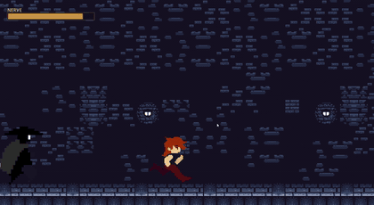
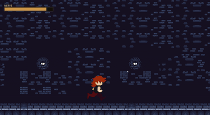
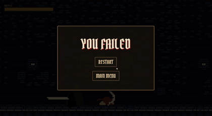

<div align="center">

#  It's Behind You!

**Don't run from what you can't see. Turn around — before it's too late.**

*An atmospheric horror reaction-runner built in Godot 4.*




</div>

---

##  The Premise

You are being hunted through an endless, torch-lit dungeon. You cannot stop
running — but something is closing the gap behind you, step by step. Your only
defense is nerve: the will to **look back** at the exact moment it lunges, and
stare it down before it takes you.

Peek too early and you waste your courage. Peek too late and… well.

## How It Plays

The run moves on its own. The tension is all in the timing.

- The creature creeps closer the longer you survive — and it **speeds up** over time.
- The instant it's on you, the screen screams **"LOOK BEHIND YOU!"**
- **Peek back** inside that window to ward it off and buy distance.
- Every peek burns **NERVE**. Mashing won't save you — it's a resource, not a reflex.
- Hold your nerve, survive the gauntlet, and reach the door to **escape**.

<table>
<tr>
<td width="50%"><br/><sub><b>The tell.</b> React to the warning — or don't.</sub></td>
<td width="50%"><br/><sub><b>You hesitated.</b> YOU FAILED.</sub></td>
</tr>
</table>

## Controls

| Action | Input |
| --- | --- |
| Peek behind you | `Spacebar` · Left-click · Tap (touch) |

That's the whole game. One button. All timing.

## Features

- **Reaction-driven horror** — no cheap deaths; the game always tells you when to act.
- **NERVE system** — a courage/stamina resource that kills the mash-to-win exploit and makes every peek a real decision.
- **Escalating dread** — the hunter accelerates and closes in the longer the run lasts.
- **Dynamic soundscape** — wind, a haunting drone, footsteps, and a heartbeat that kicks in near danger, all mixed live against your proximity to death.
- **Cinematic endings** — a fade-to-black death, or a hard-earned **"YOU ESCAPED."**
- **Desktop & mobile** — keyboard, mouse, and touch, in landscape.

## Run It Yourself

You'll need [**Godot 4.7**](https://godotengine.org/download) (mobile renderer).

```bash
git clone https://github.com/me-intenzo/Its-Behind-You-.git
```

1. Open **Godot 4.7**.
2. Click **Import** and select the `project.godot` in the cloned folder.
3. Press **F5** (or the ▶ button) to play.

## Project Structure

```
its-behind-you!/
├── scene/         # main game, menu, hero, villain, door, credits
├── script/        # GDScript: game_manager, hero, villain, …
├── asset/
│   ├── object/    # sprites: hero, villain, environment tileset & parallax bg
│   ├── sound/     # ambient, SFX, music
│   └── font/      # Pirata One, Dungeon font
└── project.godot
```

The heart of the game lives in [`script/game_manager.gd`](script/game_manager.gd) —
the approach/difficulty ramp, the NERVE economy, the *"look behind you"* tell,
the live audio mix, and both endings all run from there.

## Credits

| | |
| --- | --- |
| **Art** | incolgames · brullov · aimmaga · lizcheong |
| **Music** | ludoloonstudio · liminal-space-dev · dragon studio · fronbondi_skegs |
| **Font** | [Pirata One](https://fonts.google.com/specimen/Pirata+One) (OFL) |
| **Engine** | [Godot](https://godotengine.org/) |

<div align="center">
<br/>
<sub>Built with Godot · <i>Don't look away.</i></sub>
</div>
